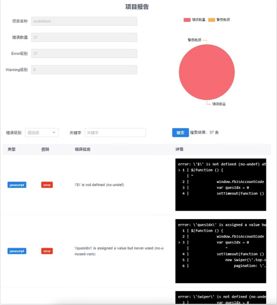

# Preporter
#### A tool that can detect java script errors and generate reports.

## Screenshot


## Start
```
npm install preporter -g
```

## DEMO
1. Get into your project.
```
cd D:\demo
```

2. Input command.

```
reporter . demo
```

3. Open ```reporter.html``` in the current directory

## License
Everything is MIT.